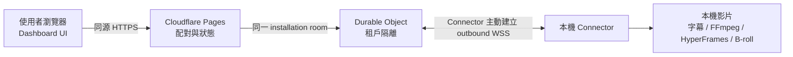
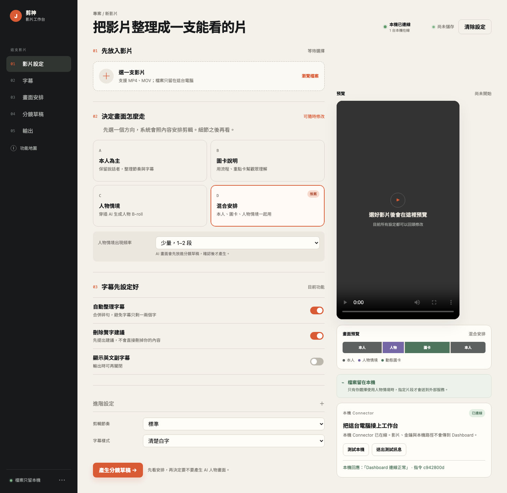

# 剪神 Dashboard 上手指南

剪神 Dashboard 是「選工作方式、看目前狀態、確認分鏡」的工作台。真正的影片、字幕、FFmpeg、HyperFrames 與可選的 B-roll provider 仍在使用者本機執行。

## 先開啟工作台

- [開啟剪神 Dashboard](https://awesome-janson-dashboard-staging.pages.dev/)
- [查看功能地圖](https://awesome-janson-dashboard-staging.pages.dev/analysis.html)

目前這個網址是可驗收的 staging 版本。使用者不需要 Cloudflare 帳號，也不需要 Google 登入。

## 第一次使用：5 步驟

### 1. 啟動本機 Connector

在 Awesome-Janson 專案根目錄執行：

```bash
JANSON_DASHBOARD_URL=https://awesome-janson-dashboard-staging.pages.dev \
python3 -m scripts.local_connector --serve-once
```

Connector 會自動開啟瀏覽器配對頁。第一次驗收的 `--serve-once` 會服務一個 60 秒工作階段；目前 Connector 還是開發版 runtime，尚未包成 macOS 安裝器或常駐服務。

### 2. 放入影片

在「影片設定」按「瀏覽檔案」，或把影片拖進工作台。影片只用於本機預覽，不會因為開啟 Dashboard 就上傳。

### 3. 選擇畫面安排

| 選項 | 適合情境 | 會做什麼 |
| --- | --- | --- |
| 本人為主 | 課程、訪談、口播 | 保留說話者，整理節奏與字幕 |
| 圖卡說明 | 教學、流程、重點整理 | 用動態圖卡輔助理解 |
| 人物情境 | 需要真人 B-roll | 在指定段落穿插人物情境 |
| 混合安排 | 大多數產品介紹與知識短片 | 本人、圖卡、人物情境一起安排 |

不確定時先選「混合安排」。人物情境會先進入分鏡草稿，確認後才產生，不會直接消耗外部 provider 額度。

### 4. 設定字幕

先保留「自動整理字幕」與「刪除贅字建議」。剪神會先提出建議，不會直接刪掉你的內容；英文副字幕則依發布平台再開關。

### 5. 產生分鏡，再決定要不要出片

按「產生分鏡草稿」後，先看每段要用本人、圖卡還是人物情境。確認分鏡後才進入正式剪輯／渲染。

## 連線怎麼接



雲端只傳小型命令與狀態，例如 `connector.health`、`job.echo`。第一版不傳原始影片、輸出影片、API key、本機路徑或任意 shell 指令。

## Dashboard 畫面怎麼看



看右上角與右側「本機 Connector」卡片：

- 「本機已連線」：本機 Connector 在線，可以送出測試命令。
- 「本機離線」：Dashboard 還在，但本機 Connector 沒有在線；重新啟動 Connector。
- 「尚未配對」：這個瀏覽器沒有有效 session，從本機 Connector 重新開啟配對頁。
- 「本機模式」：目前是靜態本機預覽頁，尚未接上 Dashboard API。

## 用哪個入口比較好

| 你的目的 | 使用方式 |
| --- | --- |
| 直接叫 AI Agent 幫你剪 | 把本 repo 網址交給 Claude Code、Codex 或其他支援 Skill 的 Agent |
| 自己看選單與分鏡 | 開啟 Dashboard，照 5 步驟操作 |
| 影片不離開電腦 | 啟動本機 Connector，所有正式剪輯仍走本機流程 |
| 需要人物 B-roll | 選「人物情境」或「混合安排」，先確認分鏡再啟用 provider |

完整功能分類與 provider 邊界見 [功能地圖](https://awesome-janson-dashboard-staging.pages.dev/analysis.html)。
