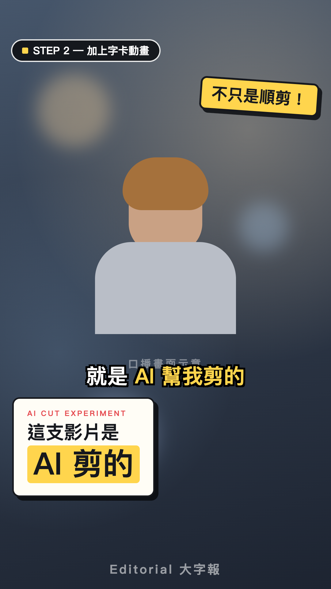
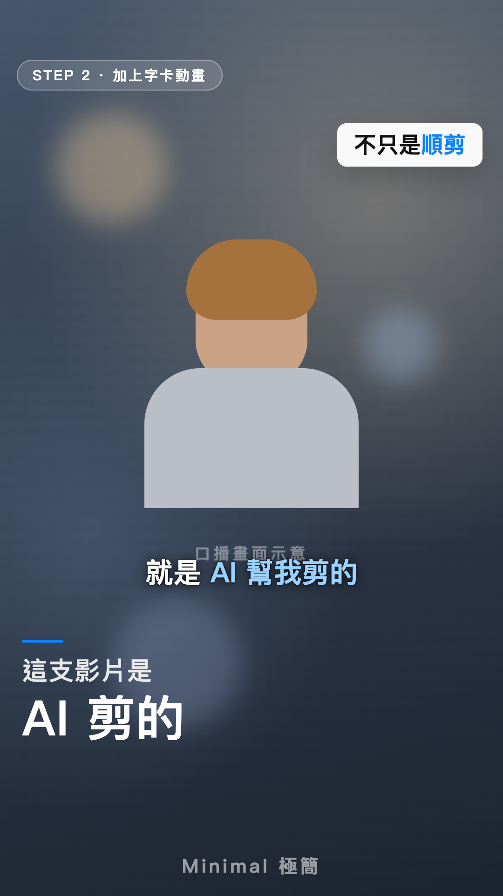
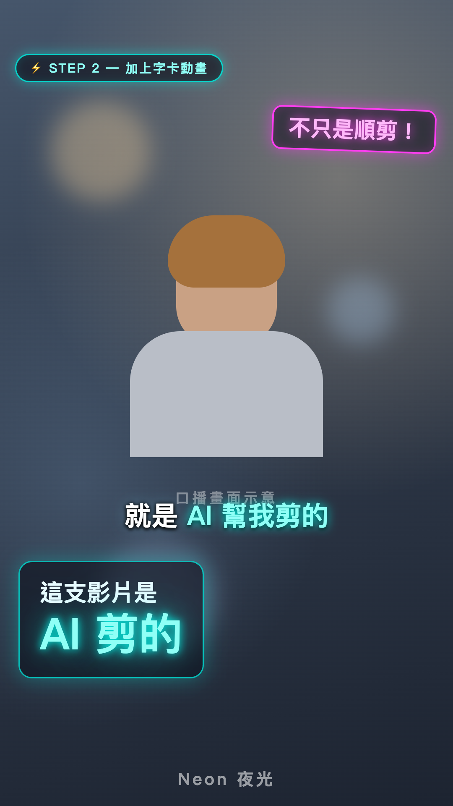
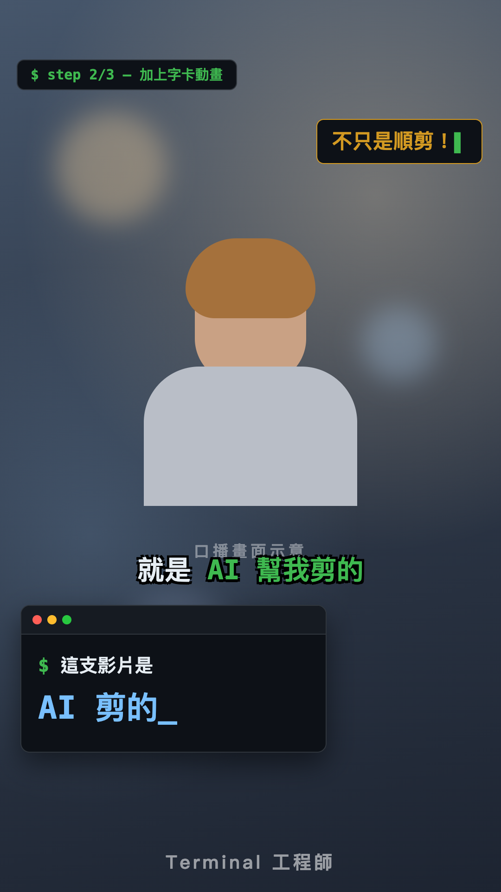

# 短影片大師 Shorts Master

> 把一堆邊走邊講、吃螺絲、重錄好幾次的手機亂錄片段，變成一支帶 AI B-roll（本人入鏡）、動態字卡、繁中字幕、背景音樂的精緻直式短影片——全程由 AI agent 操刀，你只要在每個階段點頭。

這是一個 [Claude Code](https://claude.com/claude-code) **Agent Skill**。對 Claude 說「幫我剪片」並丟入素材，它會走完七個階段，每階段先給你看一版再繼續。

## 七階段管線

| 階段 | 做什麼 |
|------|--------|
| 1️⃣ 順剪 | word-level 轉錄 → 自動挑最佳 take、剪吃螺絲/重錄/語助詞 → 無損拼接 |
| 2️⃣ 壓時長＋語速 | 語意砍冗余 → 變速不變調（1.1–1.3x 甜蜜區） |
| 3️⃣ AI B-roll | 用你的照片保臉生成情境畫面（開會、工作室…），蓋過剪接點兼當轉場 |
| 4️⃣ 字卡動畫 | Editorial 大字報、強調貼紙、指尖圖表、手繪圈臉…全部對準逐字稿時間軸 |
| 5️⃣ 繁中字幕 | 雙樣式（基本＋關鍵句放大變色彈入），ASR 錯字逐句修正 |
| 6️⃣ 聲音 | AI 生成 BGM＋人聲美化鏈（去風切/降噪/EQ/壓縮/響度標準化） |
| 7️⃣ 交付 | 48kHz 相容性驗收（LINE 可直傳）＋逐格 QC |

## 六套字卡風格

Phase 4 開工時六選一，同一套 15 種卡片結構、六種完全不同的視覺人格：

| | | |
|:---:|:---:|:---:|
|  |  |  |
| **Editorial 大字報**<br>精緻 YouTuber、知識創作者 | **Variety 綜藝爆字**<br>搞笑、娛樂、實況精華 | **Whiteboard 手寫筆記**<br>教學型、邊講邊畫人設 |
|  |  |  |
| **Minimal 極簡**<br>質感品牌、生活風格 | **Neon 夜光**<br>3C 科技、潮流、夜生活 | **Terminal 工程師**<br>工程師人設、AI 教學 |

字幕樣式會跟著風格連動（綜藝版更粗更跳、terminal 版等寬綠字…）。

## 安裝

```bash
git clone https://github.com/zenbuapps/shorts-master.git ~/.claude/skills/shorts-master
```

重啟 Claude Code session 即生效。

## 前置需求

核心工具（免費）：`ffmpeg`（需含 libass，macOS 用 `brew install ffmpeg-full`）、Node.js 22+（HyperFrames）、[video-use](https://github.com/heygen-com/video-use) 工具鏈。

AI 服務（按能力挑，缺哪補哪，詳見 [`references/integrations.md`](references/integrations.md)）：

| 能力 | 首選 | 免費替代 |
|------|------|---------|
| 轉錄 | ElevenLabs Scribe | faster-whisper（本地） |
| 生圖保臉＋生影片 | [Higgsfield MCP](https://higgsfield.ai/mcp)（一行接入） | ComfyUI Cloud／OpenRouter 生圖 |
| 音樂 | Lyria 3（Gemini key，$0.08/首）或 ElevenLabs Music | 發佈平台內建曲庫 |

## 用法

```
幫我剪片 /path/to/clip1.mp4 /path/to/clip2.mp4 ...
目標 60 秒，臉部參考照在 /path/to/selfies/
```

之後就是七次「看一版 → 給意見或說 OK」。改任何字卡、字幕、B-roll 都是改表重跑，約 2 分鐘一輪。

## 檔案結構

```
SKILL.md                        主流程（七階段＋踩雷速查＋red flags）
helpers/map_timeline.py         時間軸映射：原始素材時間 ⇄ 剪接+變速後成品時間
references/
├── integrations.md             三條 AI 服務串接路線（Higgsfield／ComfyUI Cloud／OpenRouter）
├── gotchas.md                  踩雷全集（每一條都是實戰換來的）
├── card-patterns.md            8 種字卡樣式庫（含可複製的 CSS/GSAP 配方）
└── gen_subs_template.py        繁中雙樣式 ASS 字幕生成模板
```

## 出身

本 skill 沉澱自兩支實際發佈影片的完整製作過程——所有 gotcha 都是真實踩過的雷，所有配方都出過片。第二支影片即是用本 skill 一次跑完全程的驗證作。

## License

MIT
